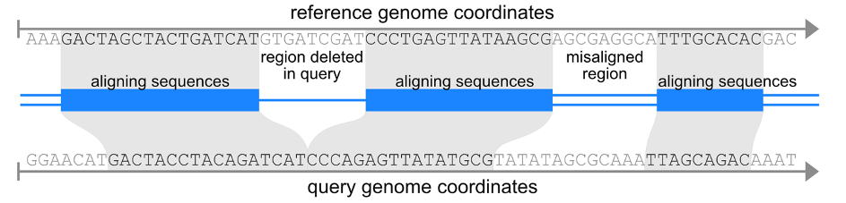

# Make Lastz Chains

[](https://github.com/psf/black)

[](https://www.nextflow.io/)

Portable Hillerlab solution for generating pairwise genome alignment chains.
These chains can be used as input for [TOGA](https://github.com/hillerlab/TOGA) or for generating multiz alignments.

Perl-based pipeline is still available in the [first_version_backup branch](https://github.com/hillerlab/make_lastz_chains/tree/first_version_backup).



Chains explained:
http://genomewiki.ucsc.edu/index.php/Chains_Nets

Chain format specification:
https://genome.ucsc.edu/goldenPath/help/chain.html

## Usage

⚠️ Although the pipeline runs on macOS, it is strongly recommended to use it on a Linux-based machine.

### Installation:

Install nextflow:
https://www.nextflow.io/docs/latest/getstarted.html

Please note that Nextflow requires a java runtime.
Please also install `lastz` (https://github.com/lastz/lastz/) and add a binary to your `$PATH`. 

Then do the following:

```bash
git clone git@github.com:hillerlab/make_lastz_chains.git
cd make_lastz_chains
# install python packages (just one actually for now)
pip3 install -r requirements.txt
# The pipeline requires many UCSC Kent binaries,
# they can be downloaded using this script,
# unless they are already in the $PATH:
./install_dependencies.py
```

If you wish to run the old pipeline version, please do `git checkout first_version_backup` in
the make_lastz_chains directory.

#### Kent Binaries

Aside from lastz, the pipeline depends on some binaries from UCSC Kent.
Install_dependencies.py tries to download them from (https://hgdownload.cse.ucsc.edu/admin/exe/).
However, they can also be installed using conda.
The following UCSC Kent binaries are required:

```text
twoBitToFa
faToTwoBit
pslSortAcc
axtChain
chainAntiRepeat
chainMergeSort
chainCleaner
chainSort
chainScore
chainNet
axtToPsl
chainFilter
```

For example, to install `axtChain` using conda, the following command can be used:

`conda install -c bioconda ucsc-axtchain`

### Running the pipeline

The script to be called is `make_chains.py`.

```bash
### Minimal example
./make_chains.py ${target_genome_id} ${query_genome_id} ${target_genome_sequence} ${query_genome_sequence} --executor ${cluster_management_system} --project_dir test
 ```

A quick test sample:

```bash
# fasta input
./make_chains.py target query test_data/test_reference.fa test_data/test_query.fa --pd test_out -f --chaining_memory 16
# 2bit file input - pls create 2bit files from fasta using faToTwoBit before
./make_chains.py target query test_data/test_reference.2bit test_data/test_query.2bit --pd test_out -f --chaining_memory 16
```

### Full list of the pipeline CLI parameters

Detailed explanation for some of these parameters is provided below.

```text
positional arguments:
  target_name           Target genome identifier, e.g. hg38, human, etc.
  query_name            Query genome identifier, e.g. mm10, mm39, mouse, etc.
  target_genome         Target genome. Accepted formats are: fasta and 2bit.
  query_genome          Query genome. Accepted formats are: fasta and 2bit.

optional arguments:
  -h, --help            show this help message and exit
  --project_dir PROJECT_DIR, --pd PROJECT_DIR
                        Project directory. By default: pwd
  --continue_from_step {partition,lastz,cat,chain_run,chain_merge,fill_chains,clean_chains}, --cfs {partition,lastz,cat,chain_run,chain_merge,fill_chains,clean_chains}
                        Continue pipeline execution from this step
  --force, -f           Overwrite output directory if exists
  --cluster_executor CLUSTER_EXECUTOR
                        Nextflow executor parameter
  --cluster_queue CLUSTER_QUEUE
                        Queue/Partition label to run cluster jobs
  --keep_temp, --kt     Do not remove temp files
  --params_from_file PARAMS_FROM_FILE
                        Read parameters from a specified config file

Pipeline Parameters:
  --skip_fill_chain
  --skip_fill_unmask
  --skip_clean_chain
  --lastz_y LASTZ_Y
  --lastz_h LASTZ_H
  --lastz_l LASTZ_L
  --lastz_k LASTZ_K
  --seq1_chunk SEQ1_CHUNK
  --seq1_lap SEQ1_LAP
  --seq1_limit SEQ1_LIMIT
  --seq2_chunk SEQ2_CHUNK
  --seq2_lap SEQ2_LAP
  --seq2_limit SEQ2_LIMIT
  --min_chain_score MIN_CHAIN_SCORE
  --chain_linear_gap {loose, medium}
  --num_fill_jobs NUM_FILL_JOBS
  --fill_chain_min_score FILL_CHAIN_MIN_SCORE
  --fill_insert_chain_min_score FILL_INSERT_CHAIN_MIN_SCORE
  --fill_gap_max_size_t FILL_GAP_MAX_SIZE_T
  --fill_gap_max_size_q FILL_GAP_MAX_SIZE_Q
  --fill_gap_min_size_t FILL_GAP_MIN_SIZE_T
  --fill_gap_min_size_q FILL_GAP_MIN_SIZE_Q
  --fill_lastz_k FILL_LASTZ_K
  --fill_lastz_l FILL_LASTZ_L
  --fill_memory FILL_MEMORY
  --fill_prepare_memory FILL_PREPARE_MEMORY
  --chaining_memory CHAINING_MEMORY
  --chain_clean_memory CHAIN_CLEAN_MEMORY
  --clean_chain_parameters CLEAN_CHAIN_PARAMETERS
  --job_time_req JOB_TIME_REQ
```

#### Target and query genome IDs

These are simply strings that differentiate between the target and query genome names.
For example, hg38 and mm10 will work.
They could also be human and mouse, or even h and m.
Technically, any reasonable sequence of letters and numbers should work.

#### Genome sequences

Genome sequences can be provided in either `fasta` or `twobit` formats.
Please find the 2bit file format specification [here](https://genome.ucsc.edu/FAQ/FAQformat.html#format7).

⚠️ **Warning**

If your scaffold names are numbered, such as NC_00000.1, consider removing the scaffold numbers
(rename NC_00000.1 to NC_00000 or NC_00000__1, for example). Some tools, especially those included
in the make_chains workflow, may not handle such identifiers correctly.
The pipeline will attempt to trim scaffold numbers automatically for proper data processing.

The chain format does not allow spaces in scaffold names,
as spaces are the delimiter characters for chain headers.
If the pipeline detects spaces in the chain headers, it will crash.

If you wish to rename reference and query chromosomes or scaffolds back to their original names,
please use the `standalone_scripts/rename_chromosomes_back.py` script.

#### Project directory

This is the directory where all steps will be executed (not a mandatory argument).
By default, the pipeline saves all intermediate files in the directory where the pipeline was initiated.
Therefore, it's strongly recommended to specify the project directory.

#### Executor / available clusters

The executor option determines the cluster management system to use.
By default, the pipeline uses the `local` executor, which means it only utilizes the CPU
of the machine where it's running. However, genome alignment is a computationally intensive task,
so it's advisable to run the pipeline on either a powerful machine with multiple CPUs or a cluster.
To run the pipeline on a Slurm cluster, for instance, add the `--executor slurm` option.
Refer to the [Nextflow documentation](https://www.nextflow.io/docs/latest/executor.html) for a list of supported executors.

#### Reading pipeline parameters from JSON file

The pipeline saves its parameters in a `pipeline_parameters.json` file.
This file can be used to easily replicate the pipeline's settings for another run.
To do so, use the `--params_from_file {params_json}` option when launching the pipeline.
This ensures that the pipeline will run with the same parameters as specified in the JSON file,
streamlining the process for multiple runs.  If you wish to make adjustments, the JSON file
is easily editable, allowing you to tweak parameters as needed before running the pipeline again.

### Output
The pipeline saves the resulting chain file in the project directory specified by the respective parameter.
The output file is named as follows: `${target_ID}.${query_ID}.final.chain.gz`

## Citation

- Kirilenko BM, Munegowda C, Osipova E, Jebb D, Sharma V, Blumer M, Morales A, Ahmed AW, Kontopoulos DG, Hilgers L, Lindblad-Toh K, Karlsson EK, Zoonomia Consortium, Hiller M. [Integrating gene annotation with orthology inference at scale.](https://www.science.org/stoken/author-tokens/ST-1161/full), Science, 380, 2023 
- Osipova E, Hecker N, Hiller M. [RepeatFiller newly identifies megabases of aligning repetitive sequences and improves annotations of conserved non-exonic elements.](https://academic.oup.com/gigascience/article/8/11/giz132/5631861) GigaScience, 8(11), giz132, 2019
- Suarez H, Langer BE, Ladde P, Hiller M. [chainCleaner improves genome alignment specificity and sensitivity.](https://academic.oup.com/bioinformatics/article/33/11/1596/2929344) Bioinformatics, 33(11), 1596-1603, 2017
- Kent WJ, Baertsch R, Hinrichs A, Miller W, Haussler D. [Evolution's cauldron: Duplication, deletion, and rearrangement in the mouse and human genomes](https://www.pnas.org/doi/10.1073/pnas.1932072100) PNAS, 100(20):11484-9, 2003
