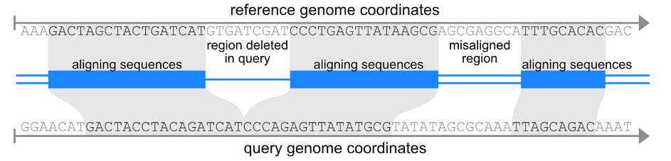

<p align="center">

  <span>
    <h1 align="center">
        make_lastz_chains
    </h1>
  </span>

  <p align="center">
    <a href="https://github.com/hillerlab/make_lastz_chains" reference="_blank">
      
    </a>
  </p>

  <p align="center">
    <samp>
        <span> portable solution for generating pairwise genome alignment chains  </span>
        <br>
        <span> The Hiller Lab at the Senckenberg Research Institute </span>
        <br>
        <br>
        <a href="https://genome.ucsc.edu/goldenPath/help/chain.html">format</a> .
        <a href="http://genomewiki.ucsc.edu/index.php/Chains_Nets">chains</a> .
        <a href="https://https://github.com/hillerlab/make_lastz_chains/blob/master/assets/pipeline/make_lastz_chains.mermaid">pipeline</a> 
    </samp>
  </p>

</p>

---

<p align="center">
  
</p>

---

> [!IMPORTANT]
> - **Softmask both genomes** (lowercase, do NOT hardmask). RepeatModeler 2 per genome is recommended; add WindowMasker if you see runaway LASTZ runtimes.
> - **Scaffold names**: no spaces; avoid dots (rename `NC_00000.1` → `NC_00000`)
> - Inputs accepted: `.fasta` or `.2bit`.

---

## Usage

> [!NOTE]
> Requirements: Nextflow ≥ 25.04.6, Docker or Apptainer, Java.

```bash
git clone https://github.com/hillerlab/make_lastz_chains.git
cd make_lastz_chains
```

Edit `params.json` (set `reference_name`, `query_name`, `reference_genome`, `query_genome`), then:

```bash
# Docker
nextflow run main.nf -params-file params.json -profile docker

# Apptainer / Singularity
nextflow run main.nf -params-file params.json -profile apptainer
```

Smoke test:
```bash
nextflow run main.nf -profile test,apptainer
```

Resume runs from checkpoints [fill_chains, clean_chains]:
```bash

# Restart after alignment but before filling chains [ 04_axtchain/merged_chains ]
nextflow run main.nf -profile <PROFILE> -params-file params.json \
    --from fill_chains \
    --merged_chain_path  results/04_axtchain/merged_chains/<CHAIN> 

# Restart afterf filling chains but before cleaning them [ 05_filled_chains ]
nextflow run main.nf -profile <PROFILE> -params-file params.json \
    --from clean_chains \
    --filled_chain_path  results/fill_chains/hg38.mm39.filled.chain.gz 
```

> [!NOTE]
> You can also specify these options directly in `params.json`.

A helper sh script is provided to run the pipeline on a SLURM cluster. See details below.

<details>
<summary>Click to expand</summary>


Edit the path variables at the top of `assets/scripts/run_nf_slurm_example.sh` (cache dir, container image, manifest path), then submit:

```bash
sbatch --array=1-<N> run_nf_slurm_example.sh
```

Each array task spawns one Nextflow head job that submits all compute as child SLURM jobs.

LASTZ, AXT_CHAIN, and REPEAT_FILLER run as SLURM job arrays. Partition routing, array sizes, and resource tiers are documented inline in `nextflow.config` — edit there to match your cluster.

</details>

---

## Output

```
results/
├── 00_genome_prep/      reference.2bit, query.2bit, *.chrom.sizes
├── 01_partition/        *_partitions.txt
├── 02_lastz_psl/        *.psl 
├── 03_concat_lastz_output/    *.psl.gz 
├── 04_axtchain/         *.chain
├─── • chain_antirepeat/ *.chain.gz
├─── • merged_chains/    *.all.chain.gz     ← checkpoint for --from fill_chains
├── 05_filled_chains/    *.filled.chain.gz  ← checkpoint for --from clean_chains
├── 06_cleaned_chains/   *.final.chain.gz
├── 07_final/            *.final.chain.gz   ← final output
└── pipeline_info/    timeline, trace, DAG
```

---

## Where to edit

| File | What |
|------|------|
| `params.json` | Genome paths, alignment settings, checkpoints — per run |
| `nextflow.config` | Compute resources, profiles, container, SLURM — rarely |

---

## Citation

- Kirilenko BM, Munegowda C, Osipova E, Jebb D, Sharma V, Blumer M, Morales A, Ahmed AW, Kontopoulos DG, Hilgers L, Lindblad-Toh K, Karlsson EK, Zoonomia Consortium, Hiller M. [Integrating gene annotation with orthology inference at scale.](https://www.science.org/stoken/author-tokens/ST-1161/full) Science, 380, 2023
- Osipova E, Hecker N, Hiller M. [RepeatFiller newly identifies megabases of aligning repetitive sequences and improves annotations of conserved non-exonic elements.](https://academic.oup.com/gigascience/article/8/11/giz132/5631861) GigaScience, 8(11), giz132, 2019
- Suarez H, Langer BE, Ladde P, Hiller M. [chainCleaner improves genome alignment specificity and sensitivity.](https://academic.oup.com/bioinformatics/article/33/11/1596/2929344) Bioinformatics, 33(11), 1596-1603, 2017
- Kent WJ, Baertsch R, Hinrichs A, Miller W, Haussler D. [Evolution's cauldron: Duplication, deletion, and rearrangement in the mouse and human genomes.](https://www.pnas.org/doi/10.1073/pnas.1932072100) PNAS, 100(20):11484-9, 2003
- Mu NT, Dizon W, Otero G, Battelle T. [Optimizing Nextflow-based Software on Shared HPC Resources: A Case Study with make_lastz_chains.](https://doi.org/10.5281/zenodo.17118383) US Research Software Engineering Conference (USRSE'25), Philadelphia, PA, 2025
