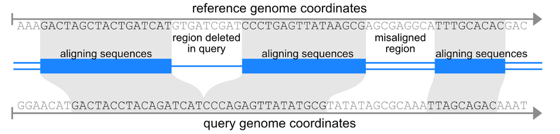

<p align="center">
<p align="center">
  <picture>
    <source
      media="(prefers-color-scheme: dark)"
      srcset="./assets/figures/hillerlab-dark.png"
    >
    <source
      media="(prefers-color-scheme: light)"
      srcset="./assets/figures/hillerlab-light.png"
    >
    
  </picture>
</p>

  <span>
    <h1 align="center">
        <code>make_lastz_chain</code>
    </h1>
  </span>

  <p align="center">
    <a href="https://github.com/hillerlab/make_lastz_chains" reference="_blank">
      
    </a>
  </p>

  <p align="center">
    <samp>
        <span> portable solution for generating pairwise genome alignment chains  </span>
        <br>
        <span> The Hiller Lab at the Senckenberg Research Institute </span>
        <br>
        <br>
        <a href="https://genome.ucsc.edu/goldenPath/help/chain.html">format</a> .
        <a href="http://genomewiki.ucsc.edu/index.php/Chains_Nets">chains</a> .
        <a href="https://github.com/hillerlab/make_lastz_chains/blob/main/assets/pipeline/make_lastz_chains.mermaid">pipeline</a> 
    </samp>
  </p>

</p>

---

<p align="center">
  
</p>

---

> [!IMPORTANT]
> - **Softmask both genomes** (lowercase, do NOT hardmask). RepeatModeler 2 per genome is recommended; add WindowMasker if you see runaway LASTZ runtimes. We also provide a soft-masking solution in [softmask](https://github.com/hillerlab/softmask).
> - **Scaffold names**: no spaces; avoid dots (rename `NC_00000.1` → `NC_00000`)
> - Inputs accepted: `.fasta` or `.2bit`.
> - **Container image**: We offer a pre-built container image for the whole pipeline as well as individual modules. By default the pipeline runs with [ghcr.io/hillerlab/make_lastz_chains:latest](https://github.com/hillerlab/containers/pkgs/container/make_lastz_chains). Additional images can be found at [containers](https://github.com/hillerlab/containers) and nextflow modules at [core](https://github.com/hillerlab/core).
> - **UCSC replacement**: As of >=3.1.0, the pipeline uses [chaintools](https://github.com/alejandrogzi/chaintools), a Rust library to work with .chain files. As of >=3.1.5, the pipeline uses [psltools](https://github.com/alejandrogzi/psltools), a Rust library to work with .psl files.

---

## Usage

> [!NOTE]
> Requirements: Nextflow ≥ 25.04.6, Docker or Apptainer, Java.

```bash
git clone https://github.com/hillerlab/make_lastz_chains.git
cd make_lastz_chains
```

Edit `params.json` (set `reference_name`, `query_name`, `reference_genome`, `query_genome`), then:

```bash
# Docker
nextflow run main.nf -params-file params.json -profile docker

# Apptainer / Singularity
nextflow run main.nf -params-file params.json -profile apptainer
```

Alternatively, keep the alignment settings in `params.json` and provide the genome paths and output directory as command-line arguments:

```bash
nextflow run main.nf -params-file params.json -profile docker \
    --reference_genome /path/to/reference.2bit \
    --query_genome /path/to/query.2bit \
    --outdir results
```

Command-line parameters override matching values from `params.json`; all other parameters continue to come from the file.

### Alignment backend

`--aligner` picks which aligner produces the PSL alignments. Everything downstream
(chain building, filling, cleaning) is identical for both.

```
                    PREPARE_GENOMES ──► .2bit + chrom.sizes
                              │
              ┌───────────────┴────────────────┐
              │                                │
      aligner=lastz                    aligner=kegalign (gpu profile)
              │                                │
      LASTZ_ALIGNMENT (CPU)             KEGALIGN_ALIGNMENT
      PARTITION_REFERENCE /            REFERENCE_TO_FA / QUERY_TO_FA
      PARTITION_QUERY                  (.2bit → FASTA)
              │                                │
      N × LASTZ (run_lastz.py)         KEGALIGN [kegalign-full, GPU]
              │ psl per pair           runner.py --output-type tarball
              │                        faToTwoBit → work/{ref,query}.2bit
              │                        kegalign --format axt+ (K,L,H,Y thresholds)
              │                        package_output.py → data_package.tgz
              │                                │
              │                  ┌─────────────┴──────────────┐
              │           executor=batched          executor=distributed
              │           KEGALIGN_LASTZ            KEGALIGN_EXPAND
              │           run_lastz_tarball.py      (parse commands.json)
              │           [kegalign-full]                  │
              │           → .axt                   N × KEG_LASTZ
              │           → AXT_TO_PSL             run_keg_lastz.py
              │           → .psl                   → .psl each
              │                  └─────────────┬──────────────┘
              │                                │
              │              psl_gz: (meta, [psl_files])  ← same contract
              └───────────────┬────────────────┘
                              │
                       CHAIN_BUILD (identical downstream)
              PSLTOOLS_SPLIT ─► PSL_BUNDLE ─► AXT_CHAIN ─► chainc ─► … ─► .chain.gz
```

Both backends converge on the identical `psl_gz` contract, so chain building,
filling and cleaning are unchanged.

```bash
# CPU LASTZ over partitioned chunks (default)
nextflow run main.nf -params-file params.json -profile docker --aligner lastz

# KegAlign: GPU seeding + HSP filtering, then batched CPU LASTZ gapped extension
nextflow run main.nf -params-file params.json -profile docker,gpu --aligner kegalign

# ...with each KegAlign partition as its own Nextflow task (spreads across nodes)
nextflow run main.nf -params-file params.json -profile docker,gpu \
    --aligner kegalign --kegalign_executor distributed
```

`--kegalign_executor` chooses how the KegAlign backend runs its CPU gapped-extension
stage. `batched` (default) hands every partition to KegAlign's own process pool in a
single Nextflow task. `distributed` fans the partitions out as one task each, so each
caches, retries and escalates resources on its own and the work spreads across nodes;
on SLURM they are submitted as job arrays. Both consume the identical KegAlign
package and run the identical LASTZ commands, so they are scientifically equivalent —
`assets/tests/ci/compare_aligners.sh` asserts their normalised PSL and chains match exactly.

> [!IMPORTANT]
> `kegalign` needs the `gpu` profile (`--gpus all` for Docker, `--nv` for
> Apptainer/Singularity) — there is no CPU fallback, and requesting it without a GPU
> runtime fails at startup rather than silently reverting to LASTZ. KegAlign does its
> own reference/query partitioning, so `seq1_chunk` / `seq2_chunk` / `seq1_lap` /
> `seq2_lap` are unused for that backend. The four LASTZ scoring thresholds are
> shared: `lastz_k` → `--hspthresh`, `lastz_l` → `--gappedthresh`,
> `lastz_h` → `--inner`, `lastz_y` → `--ydrop`. PSL lands in `02_kegalign_psl/`.

> [!TIP]
> We recommend running the pipeline test suite with:
> ```bash
> nextflow run main.nf -profile test,apptainer
> ```
> To ensure that the pipeline runs on your system.

Resume runs from checkpoints [chain_antirepeat, fill_chains, clean_chains]:
```bash

# Restart after alignment but before repeat-cleaning them [ 04_axtchain ]
nextflow run main.nf -profile <PROFILE> -params-file params.json \
    --from chain_antirepeat \
    --axtchain_path  results/04_axtchain

# Restart after alignment but before filling chains [ 04_axtchain/merged_chains ]
nextflow run main.nf -profile <PROFILE> -params-file params.json \
    --from fill_chains \
    --merged_chain_path  results/04_axtchain/merged_chains/<CHAIN> 

# Restart afterf filling chains but before cleaning them [ 05_filled_chains ]
nextflow run main.nf -profile <PROFILE> -params-file params.json \
    --from clean_chains \
    --filled_chain_path  results/fill_chains/hg38.mm39.filled.chain.gz 
```

> [!NOTE]
> You can also specify these options directly in `params.json`.

A helper sh script is provided to run the pipeline on a SLURM cluster. See details below.

<details>
<summary>Click to expand</summary>


Edit the path variables at the top of `assets/scripts/make_lastz_chains.sh` (cache dir, container image, manifest path), then submit:

```bash
sbatch --array=1-<N> make_lastz_chains.sh
```

Each array task spawns one Nextflow head job that submits all compute as child SLURM jobs.

LASTZ, AXT_CHAIN, and REPEAT_FILLER run as SLURM job arrays. Partition routing, array sizes, and resource tiers are documented inline in `nextflow.config` — edit there to match your cluster.

</details>

---

## Output

```
results/
├── 00_genome_prep/      reference.2bit, query.2bit, *.chrom.sizes
├── 01_partition/        *_partitions.txt
├── 02_lastz_psl/        *.psl              ← --aligner lastz
├── 02_kegalign_psl/     *.psl              ← --aligner kegalign
├── 04_axtchain/         *.chain            ← checkpoint for --from chain_antirepeat
├─── • chain_antirepeat/ *.chain.gz
├─── • merged_chains/    *.all.chain.gz     ← checkpoint for --from fill_chains
├── 05_filled_chains/    *.filled.chain.gz  ← checkpoint for --from clean_chains
├── 06_cleaned_chains/   *.chain, *.removed.bed
├── 07_final/            *.allfilled.chain.gz   ← final output
└── pipeline_info/    timeline, trace, DAG
```

---

## Where to edit

| File | What |
|------|------|
| `params.json` | Genome paths, alignment settings, checkpoints — per run |
| `nextflow.config` | Compute resources, profiles, container, SLURM — rarely |

---

## Citation

- Kirilenko BM, Munegowda C, Osipova E, Jebb D, Sharma V, Blumer M, Morales A, Ahmed AW, Kontopoulos DG, Hilgers L, Lindblad-Toh K, Karlsson EK, Zoonomia Consortium, Hiller M. [Integrating gene annotation with orthology inference at scale.](https://www.science.org/stoken/author-tokens/ST-1161/full) Science, 380, 2023
- Osipova E, Hecker N, Hiller M. [RepeatFiller newly identifies megabases of aligning repetitive sequences and improves annotations of conserved non-exonic elements.](https://academic.oup.com/gigascience/article/8/11/giz132/5631861) GigaScience, 8(11), giz132, 2019
- Suarez H, Langer BE, Ladde P, Hiller M. [chainCleaner improves genome alignment specificity and sensitivity.](https://academic.oup.com/bioinformatics/article/33/11/1596/2929344) Bioinformatics, 33(11), 1596-1603, 2017
- Kent WJ, Baertsch R, Hinrichs A, Miller W, Haussler D. [Evolution's cauldron: Duplication, deletion, and rearrangement in the mouse and human genomes.](https://www.pnas.org/doi/10.1073/pnas.1932072100) PNAS, 100(20):11484-9, 2003
- Mu NT, Dizon W, Otero G, Battelle T. [Optimizing Nextflow-based Software on Shared HPC Resources: A Case Study with make_lastz_chains.](https://doi.org/10.5281/zenodo.17118383) US Research Software Engineering Conference (USRSE'25), Philadelphia, PA, 2025
